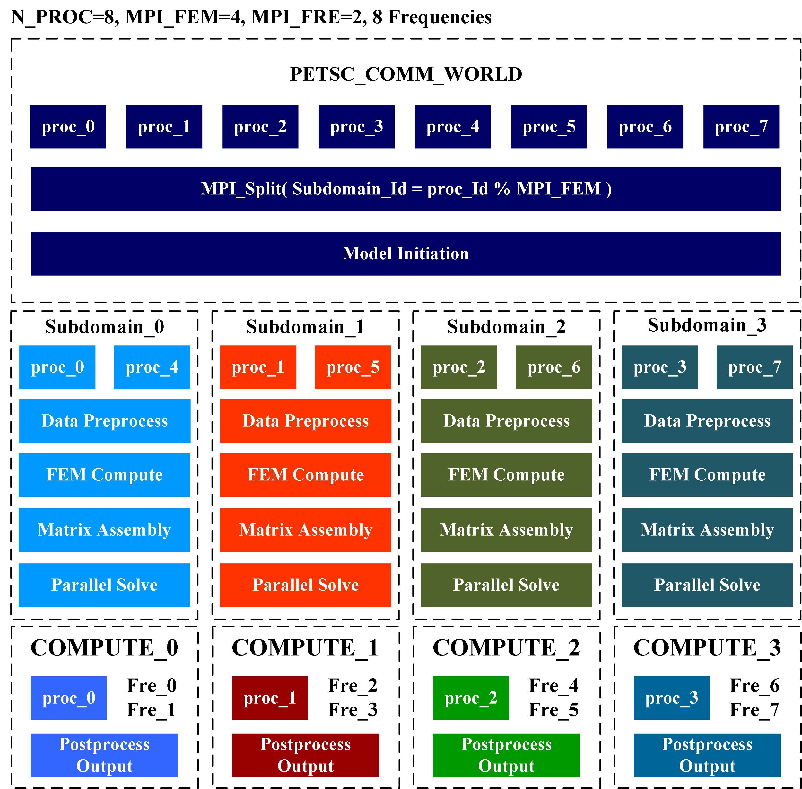

# Description
**MT3DdiverPara** implemented using MPI 3.4.2 and PETSc 3.22.0 versions. The overall parallel structure of this algorithm is controlled by three key parameters: N_PROC, MPI_FEM, and MPI_FRE. It governs the total number of processes in the communication domain PETSC_COMM_WORLD, the number of sub-communication domains, and the number of frequencies per subdomain. MPI_FEM = FRE_NUM / MPI_FRE, where FRE_NUM represents the number of frequencies. As shown in the diagram above, 8 processes (N_PROC = 8) are divided into four subdomains (MPI_FEM = 4). Through MPI_Split, the function maps global process ranks to subdomain process ranks, with each subdomain containing two processes that solve two frequencies in parallel (MPI_FRE = 2). Each subdomain stores frequency-dependent data and mesh data including node count, edge count, and element count. Within each subdomain, model initialization and data preprocessing occupy only a small portion of computation time. These steps are executed serially to minimize communication overhead caused by frequent inter-process interactions. Using the PETSc library, the coefficient matrices and solution vectors of the equations are converted to MPI AIJ distributed storage format and stored across multiple processes within subdomains, enabling parallel matrix assembly. During the parallel solving phase, each subdomain directly calls PETSc's parallel iterative solver, using two processes to handle two frequency datasets in parallel. The master process of each subdomain collects solutions from other processes for post-processing and result output.

# Make
'make'

# Requirements
mpich 3.4.2 
PETSc 3.22.0 
superlu_dist 8.0.0 
parmetis 4.0.3 
metis 5.1.0 
lapack 3.8.0 
openblas 0.3.29

# run code
$ mpirun -np 4 ./main -ksp_rtol 1e-10 -max_its 50

# important parameters
